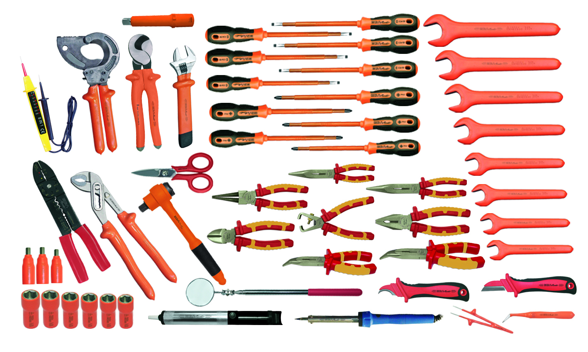

# Tools and Script

## Introduction

This tools are a simple implementation of basic tasks we personally use in our desktop setup. They span across several applications, from using the terminal in a productive way to mounting hard drives and Android phones, etc.

The scripts are based on personal experience and may not provide a good user experience to everybody, but they will at least cover the basics for everyone.

## Description of the Tools



## License

This work is licensed under the MIT License, thus «THE SOFTWARE IS PROVIDED "AS IS", WITHOUT WARRANTY OF ANY KIND, EXPRESS OR IMPLIED, INCLUDING BUT NOT LIMITED TO THE WARRANTIES OF MERCHANTABILITY, FITNESS FOR A PARTICULAR PURPOSE AND NON INFRINGEMENT.»

